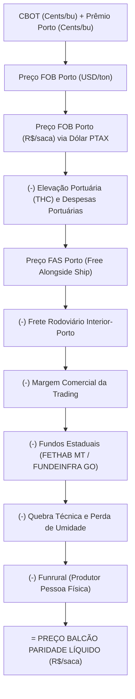
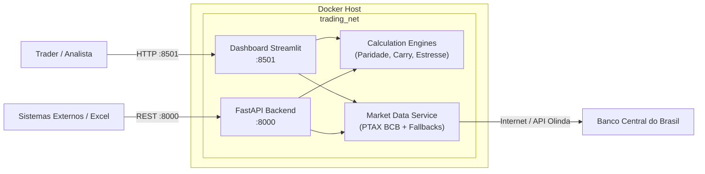

# 🏛️ Arquitetura e Engenharia Financeira: Grain Trading MVP

Este documento detalha as fórmulas matemáticas, conversões físicas, arquitetura técnica e fluxo de dados do sistema de Market Data e Formação de Preço para comercialização de grãos (Soja e Milho) no Brasil.

---

## 1. Unidades de Medida e Fatores de Conversão

O comércio internacional de grãos na CBOT (Chicago Board of Trade) é cotado em **cents de dólar americano por bushel** (\(\text{cents/bu}\)), enquanto o mercado interno brasileiro opera em **Reais por saca de 60 kg** (\(\text{R\$/sc}\)) ou **Reais por tonelada métrica** (\(\text{R\$/ton}\)).

### Soja (*Soybeans*)
* **1 bushel de soja** = \(60 \text{ lbs} = 27{,}2155 \text{ kg}\).
* **Bushels por tonelada métrica (1.000 kg)**:
  $$\text{Fator}_{\text{Soja}} = \frac{1000}{27{,}2155} = 36{,}7437 \text{ bu/ton}$$
* **Conversão de Cents/Bushel para USD/Ton**:
  $$\text{USD/ton} = \left(\frac{\text{cents/bu}}{100}\right) \times 36{,}7437 = \text{cents/bu} \times 0{,}367437$$

### Milho (*Corn*)
* **1 bushel de milho** = \(56 \text{ lbs} = 25{,}4012 \text{ kg}\).
* **Bushels por tonelada métrica (1.000 kg)**:
  $$\text{Fator}_{\text{Milho}} = \frac{1000}{25{,}4012} = 39{,}3683 \text{ bu/ton}$$
* **Conversão de Cents/Bushel para USD/Ton**:
  $$\text{USD/ton} = \left(\frac{\text{cents/bu}}{100}\right) \times 39{,}3683 = \text{cents/bu} \times 0{,}393683$$

### Relação Saca / Tonelada no Brasil
* 1 saca oficial no Brasil = **60 kg**.
* 1 tonelada métrica = \(1.000 \text{ kg} = 16{,}6667 \text{ sacas}\).
* Portanto, para passar de \(\text{R\$/ton}\) para \(\text{R\$/saca}\):
  $$\text{R\$/saca} = \text{R\$/ton} \times 0{,}06$$

---

## 2. A Fórmula da Paridade de Exportação (FOB ➔ FAS ➔ Balcão Interior)

A formação de preço do grão no interior parte do valor internacional colocado no navio (**FOB Porto**) e deduz progressivamente os custos logísticos, tributários e operacionais até a fazenda/armazém.

### Passo a Passo Matemático:

1. **Preço FOB Porto em Cents por Bushel**:
   $$\text{FOB}_{\text{cents/bu}} = \text{CBOT}_{\text{cents/bu}} + \text{Prêmio}_{\text{cents/bu}}$$

2. **Preço FOB Porto em USD por Tonelada**:
   $$\text{FOB}_{\text{USD/ton}} = \text{FOB}_{\text{cents/bu}} \times \left(\frac{\text{Bushels por Ton}}{100}\right)$$

3. **Preço FOB Porto em R$ por Saca**:
   $$\text{FOB}_{\text{R\$/sc}} = \text{FOB}_{\text{USD/ton}} \times \text{PTAX}_{\text{USD/BRL}} \times 0{,}06$$

4. **Custos Portuários (Elevação e Despacho)**:
   $$\text{CustoPorto}_{\text{R\$/sc}} = \left(\text{Elevação}_{\text{USD/ton}} \times \text{PTAX} + \text{Despesas}_{\text{R\$/ton}}\right) \times 0{,}06$$

5. **Preço FAS Porto (Free Alongside Ship)**:
   $$\text{FAS}_{\text{R\$/sc}} = \text{FOB}_{\text{R\$/sc}} - \text{CustoPorto}_{\text{R\$/sc}}$$

6. **Deduções Internas e Fiscais**:
   * **Frete Rodoviário**: \(\text{Frete}_{\text{R\$/sc}} = \text{Frete}_{\text{R\$/ton}} \times 0{,}06\)
   * **Margem da Trading**: \(\text{Margem}_{\text{R\$/sc}} = \text{Margem}_{\text{USD/ton}} \times \text{PTAX} \times 0{,}06\)
   * **Fundo Estadual**: Valor fixo por saca (\(\text{FETHAB}\) em MT \(\approx \text{R\$} 2{,}85\); \(\text{FUNDEINFRA}\) em GO \(\approx \text{R\$} 1{,}65\))
   * **Quebra Técnica**: Incidente sobre o valor bruto interior (\(\approx 0{,}3\%\))
   * **Funrural**: Alíquota previdenciária (\(\approx 1{,}5\%\))

7. **Preço de Paridade Balcão Líquido (\(\text{R\$/saca}\))**:
   $$\text{Paridade} = \frac{\left(\text{FAS} - \text{Frete} - \text{Margem} - \text{FundoEstadual}\right) \times (1 - \text{Quebra}\%)}{1 + \text{Funrural}\%}$$

8. **Spread de Originação (Basis)**:
   $$\text{Spread} = \text{Paridade Teórica} - \text{Preço Balcão Praticado no Mercado}$$
   * Se **\(\text{Spread} > 0\)**: Margem positiva para a trading comprar do produtor.
   * Se **\(\text{Spread} < 0\)**: Preço físico interior está inflacionado em relação ao porto.

---

## 3. Curva Forward e Custo de Carrego (Cost of Carry)

Determina se o spread entre o preço spot e os contratos futuros futuros (ex: Vender em Março vs. Julho) compensa carregar a commodity.

$$\text{Spread Bruto} = \text{Preço Forward} - \text{Preço Spot}$$

$$\text{Custo de Carrego Total} = \text{Armazenagem} + \text{Custo de Oportunidade (CDI)} + \text{Quebra}$$

* **Armazenagem Física**:
  $$\text{CustoArmazém} = \text{TarifaMensal}_{\text{R\$/sc}} \times \text{Meses}$$
* **Custo de Oportunidade Financeira (CDI)**:
  $$\text{CustoCapital} = \text{Preço Spot} \times \left[(1 + i_{\text{mês}})^{\text{Meses}} - 1\right]$$
* **Carrego Líquido (Net Carry)**:
  $$\text{Net Carry} = \text{Spread Bruto} - \text{Custo de Carrego Total}$$

### Regra de Decisão do Motor:
* **\(\text{Net Carry} > \text{R\$} 0{,}75/\text{sc}\)**: **CARREGAR PARA VENDA FUTURA** (Contango remunera os custos).
* **\(\text{Net Carry} < -\text{R\$} 0{,}75/\text{sc}\)**: **VENDER SPOT IMEDIATAMENTE** (Inversão de mercado / perda de carrego).
* **\(-\text{R\$} 0{,}75 \le \text{Net Carry} \le \text{R\$} 0{,}75\)**: **NEUTRO / INDIFERENTE**.

---

## 4. Arquitetura dos Serviços Containerizados

O ecossistema é orquestrado via `Docker Compose`:

---

## 5. Praças e Portos Pré-Configurados

| Praça de Originação | Estado | Porto Preferencial | Frete Médio (R$/ton) | Fundo Estadual |
| :--- | :---: | :---: | :---: | :---: |
| **Sorriso** | MT | Santos / Paranaguá / Barcarena | R$ 360 - 440 | FETHAB (R$ 2,85) |
| **Rondonópolis** | MT | Santos / Paranaguá | R$ 310 - 325 | FETHAB (R$ 2,85) |
| **Rio Verde** | GO | Santos | R$ 240 - 270 | FUNDEINFRA (R$ 1,65) |
| **Cascavel** | PR | Paranaguá | R$ 145 - 220 | Isento |
| **Passo Fundo** | RS | Rio Grande | R$ 130 - 190 | Isento |
| **Luís Eduardo Magalhães** | BA | Itaqui / Santos | R$ 290 - 340 | PRODEAGRO (R$ 0,60) |
